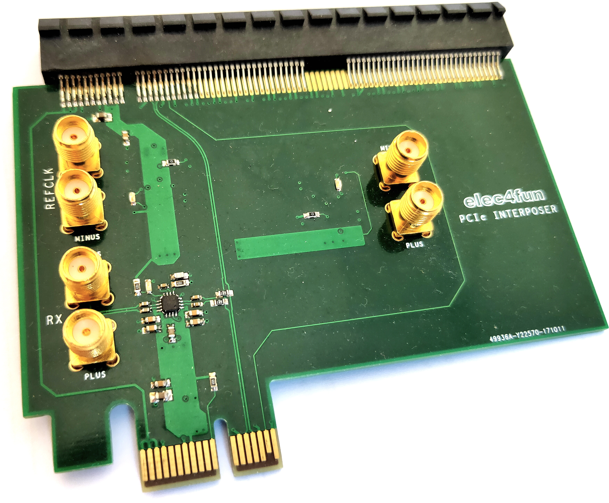

# PCIe interposer

Board design files of a PCIe interposer with SMA outputs

	Note: This design was performed in Cadence Allegro / Capture
	Those are not open sources tools. This was before I started to work with KiCAD...

# Status

This version is fully tested.

# What it is

This board can tap PCIe signals (RX, TX and clock) and output them on SMA connectors.
Output signals can the be connected to some FPGA evaluation board for capture.
I did my tests with a Xilinx AC701.
